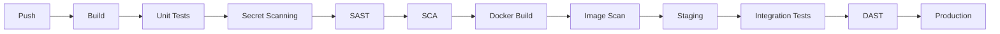

# DevSecOps CI/CD Pipeline

Personal DevSecOps project focused on designing and implementing a complete and secure CI/CD pipeline for a containerized web application.

The objective is to automate the entire software delivery lifecycle, from source code validation to deployment in production, while integrating security controls at each stage of the pipeline.

## Pipeline Overview



The final pipeline follows the following workflow:

```text
Push
 ↓
Build
 ↓
Unit Tests
 ↓
Secret Scanning
 ↓
SAST
 ↓
SCA
 ↓
Docker Image Build
 ↓
Container Image Scan
 ↓
Staging Deployment
 ↓
Integration Tests
 ↓
DAST
 ↓
Production Deployment
```

Quality and Security Gates are used throughout the pipeline to prevent vulnerable or invalid builds from progressing toward production.

---

## Security Controls

### Secret Scanning — Gitleaks

Gitleaks scans the Git repository and its history to detect credentials, API keys and other secrets accidentally committed to the project.

### Static Application Security Testing — Semgrep

Semgrep performs static security analysis of the source code using both community rules and custom rules adapted to the application.

Custom security rules include:

- detection of hardcoded JWT signing secrets;
- detection of unsafe JWT algorithm configurations;
- detection of authentication tokens written to application logs.

### Code Quality & Static Analysis — SonarQube

A self-hosted SonarQube instance performs code quality and static analysis.

The analysis is triggered automatically from GitHub Actions and the results are centralized in SonarQube.

### Software Composition Analysis — OWASP Dependency-Check

OWASP Dependency-Check analyzes third-party dependencies and identifies known vulnerabilities associated with them.

The scan:

- retrieves vulnerability information from the NVD;
- identifies vulnerable dependencies;
- reports associated CVEs and CVSS scores;
- generates an HTML vulnerability report;
- blocks the pipeline when a vulnerability exceeds the configured CVSS threshold.

Dependency-Check reports are preserved as GitHub Actions artifacts.

### Container Security — Trivy

Trivy is used to analyze the Docker image before deployment and detect vulnerabilities in:

- operating-system packages;
- application dependencies;
- container image components.

### Dynamic Application Security Testing — OWASP ZAP

After deployment to the staging environment, OWASP ZAP performs dynamic security testing against the running application before it can be promoted to production.

---

## Environments

The deployment process uses two environments:

### Staging

A temporary/pre-production environment used to validate the application in real execution conditions.

It is used for:

- integration tests;
- runtime validation;
- DAST security testing.

### Production

Only builds that successfully pass all tests and security controls are promoted to the production environment hosted on an OVHcloud VPS.

---

## Technologies

| Area | Technologies |
|---|---|
| CI/CD | GitHub Actions |
| Build & Tests | Maven, JUnit |
| Secret Scanning | Gitleaks |
| SAST | Semgrep, SonarQube |
| SCA | OWASP Dependency-Check |
| Containerization | Docker, Docker Compose |
| Image Security | Trivy |
| DAST | OWASP ZAP |
| Reverse Proxy | Nginx |
| Database | PostgreSQL |
| Infrastructure | Linux, OVHcloud VPS |

---

## Current Progress

- [x] Automated backend build
- [x] Unit tests
- [x] Secret scanning with Gitleaks
- [x] SonarQube analysis
- [x] Semgrep SAST
- [x] Custom Semgrep security rules
- [x] OWASP Dependency-Check SCA
- [x] Docker image build
- [x] Trivy image scanning
- [ ] Automated staging deployment
- [ ] Integration tests
- [ ] OWASP ZAP DAST
- [ ] Automated production deployment

---

## Running Security Scans Locally

### Semgrep

```bash
docker run --rm \
  -v "${PWD}:/src" \
  semgrep/semgrep \
  semgrep scan \
  --config=p/java \
  --config=p/owasp-top-ten \
  /src/backend
```

### OWASP Dependency-Check

From the backend directory:

```bash
mvn org.owasp:dependency-check-maven:check
```

With a CVSS security gate:

```bash
mvn org.owasp:dependency-check-maven:check \
  -DnvdApiKey=$NVD_API_KEY \
  -DfailBuildOnCVSS=7 \
  -Dformats=HTML
```

The generated report is available in:

```text
backend/target/dependency-check-report.html
```

---

## CI/CD Secrets

Sensitive values are stored using GitHub Actions Secrets and are never committed to the repository.

Examples include:

```text
SONAR_URL
SONAR_TOKEN
NVD_API_KEY
SSH_PRIVATE_KEY
VM_HOST
VM_USER
```

---

## Security Philosophy

This project follows a **shift-left security** approach.

Security checks are introduced as early as possible in the software development lifecycle instead of relying exclusively on security testing after deployment.

The pipeline combines several complementary layers:

```text
Source Code
   ↓
Secrets + SAST
   ↓
Dependencies
   ↓
SCA
   ↓
Container Image
   ↓
Image Scanning
   ↓
Running Application
   ↓
DAST
```

No single security scanner is considered sufficient on its own.

---

## Project Goal

Beyond deploying the application itself, this project is intended to provide hands-on experience with:

- CI/CD pipeline design;
- pipeline orchestration and job dependencies;
- automated testing;
- containerization;
- vulnerability management;
- DevSecOps security gates;
- staging and production environments;
- secure deployment practices;
- software supply-chain security.

The project is developed progressively, with each milestone documented through GitHub Releases.
